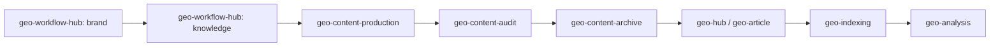

# GEO Skills Suite v3.2

> 面向 Claude Code、Codex 与其他 Agent Skills 兼容客户端的 GEO（Generative Engine Optimization）运营技能套件。
> 设计目标：**直接安装所有 `geo-*` 技能文件夹即可使用**，不依赖安装器，不绑定单一 AI 工具。

## 兼容性

- ✅ Claude Code skills
- ✅ Codex skills
- ✅ 兼容 Agent Skills 目录结构的其他客户端
- ✅ 复制安装或软链接安装
- ✅ 多客户端共享同一份用户级凭证

> 不要把整包作为单个技能安装。请将所有 `geo-*` 文件夹作为同级技能安装。

## 快速安装

将本仓库中所有 `geo-*` 文件夹复制或软链接到你的工具技能目录。

### Codex

```bash
mkdir -p ~/.codex/skills
cp -R geo-* ~/.codex/skills/
```

### Claude Code

```bash
mkdir -p ~/.claude/skills
cp -R geo-* ~/.claude/skills/
```

### 开发者软链接模式

如果你希望仓库更新后两个工具自动同步，可以使用软链接：

```bash
for d in geo-*; do
  [ -d "$d" ] && ln -sfn "$(pwd)/$d" ~/.codex/skills/"$d"
  [ -d "$d" ] && ln -sfn "$(pwd)/$d" ~/.claude/skills/"$d"
done
```

## 安装后检查

对 Claude Code 或 Codex 说：

> 使用 geo-runtime 检查我的 GEO Skills 是否安装成功。

如果当前环境支持 shell，也可以直接运行：

```bash
python3 ~/.codex/skills/geo-runtime/scripts/doctor.py
# 或
python3 ~/.claude/skills/geo-runtime/scripts/doctor.py
```

首次创建用户级配置模板：

```bash
python3 ~/.codex/skills/geo-runtime/scripts/doctor.py --init-config
```

## 配置凭证

真实 openKey 不放在技能仓库内。统一使用用户级配置：

```text
~/.geo-skills/credentials/geo-config.json
```

模板：

```json
{
  "geo": {
    "baseUrl": "https://nbgeo.aimusiclj.com",
    "openKey": "your-openKey-here",
    "referer": "https://geo.bihuoai.com/"
  },
  "defaults": {
    "companyId": 0,
    "productId": 0
  }
}
```

你可以让 AI 执行：

> 使用 geo-config 帮我初始化 GEO 平台 openKey 配置。

## 技能结构

### 支撑技能

| 技能 | 用途 |
|------|------|
| `geo-runtime` | 共享运行时、凭证读取、安装/依赖/配置诊断 |

### API 操作入口

| 技能 | 用途 |
|------|------|
| `geo-hub` | GEO 平台 API 路由入口 |
| `geo-config` | openKey、baseUrl、referer、默认 companyId/productId 配置 |
| `geo-account` | 账号、公司、产品、套餐、视频、看板等资源查询 |
| `geo-article` | 文章与素材上传、创建、查询、审核、删除 |
| `geo-indexing` | 收录任务导入、查询、删除、批量管理、结果查询 |
| `geo-publish` | 发布任务创建、校验、删除 |

### 运营工作流入口

| 技能 | 用途 |
|------|------|
| `geo-workflow-hub` | GEO 运营流程路由入口 |
| `geo-brand` | 企业/产品/个人品牌内容创建 |
| `geo-knowledge` | 知识库创建、资料整理、补充清单 |
| `geo-content` | 内容生产/审核路由入口 |
| `geo-content-production` | 关键词、标题、文章、封面、图片生产 |
| `geo-content-audit` | 一致性审核、媒体就绪、AI 检测、覆盖/Gap/优化 |
| `geo-content-archive` | GEO 项目文件归档、迁移、结构校验 |
| `geo-analysis` | 证据链、平台逆向、引用审核、PDCA 仪表盘、飞书同步 |

## 工作流概览



## 依赖

必需：

```bash
python3 -m pip install requests python-dotenv
```

可选：

```bash
python3 -m pip install Pillow       # 本地封面生成
python3 -m pip install baseopensdk  # 飞书多维表格同步
```

更多说明见 `geo-runtime/references/requirements.md`。

## 安全规则

- 真实 openKey 只放在 `~/.geo-skills/credentials/geo-config.json`。
- 删除、发布、批量导入、覆盖配置等操作必须先预览并获得用户明确确认。
- 写入/删除类 GEO API 操作后必须回查确认。
- 日志和回复中不要输出完整密钥，只能脱敏展示。

## 学员推荐用法

安装完成后，可直接向 Claude Code 或 Codex 提问：

```text
使用 geo-runtime 检查我的 GEO Skills 是否安装成功。
使用 geo-config 帮我初始化 GEO 平台 openKey 配置。
帮我为 XX 品牌规划 GEO 关键词。
帮我写一篇 GEO 文章并生成封面。
帮我审核这篇文章是否适合发布。
帮我上传这篇文章到 GEO 平台。
帮我查询这批关键词的收录结果。
```

## 许可证

MIT License - Copyright (c) 2026 chenshuke
