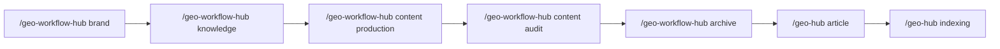

# GEO 技能包 v3.1

> GEO（Generative Engine Optimization）运营技能体系，11 大模块覆盖品牌创建、知识库搭建、内容创作、平台上传、收录检测、数据分析的全生命周期。

[]()

## 工作流概览



## 双入口架构

GEO 技能包通过两个统一入口调度全部功能，每个入口下设若干子模块：

| 入口 | 用途 | 子模块 |
|------|------|--------|
| `/geo-hub` | GEO 平台 API 操作（查询、上传、删除、配置） | geo-config、geo-account、geo-article、geo-indexing、geo-publish |
| `/geo-workflow-hub` | GEO 运营工作流（品牌、知识库、内容、分析） | geo-brand、geo-knowledge、geo-content、geo-content-production、geo-content-audit、geo-content-archive、geo-analysis |

### 路由口诀

| 操作类型 | 入口 |
|---------|------|
| **查 / 传 / 删 / 配** | `/geo-hub` |
| **建 / 规 / 写 / 审 / 优** | `/geo-workflow-hub` |

## 快速开始

### Step 1: 安装

```bash
cp -r geo-topic-expand/ ~/.claude/skills/
cd ~/.claude/skills/geo-topic-expand
pip install -r requirements.txt
```

### Step 2: 配置 API 密钥

编辑 `geo-config/geo-config.json`，填入你的 `openKey`：

```json
{
  "openKey": "你的openKey",
  "baseUrl": "https://nbgeo.aimusiclj.com",
  "referer": "https://geo.bihuoai.com",
  "defaults": {
    "companyId": 0,
    "productId": 0
  }
}
```

### Step 3: 开始使用

首次调用 `/geo-hub` 或 `/geo-workflow-hub` 时，系统会自动引导你选择 `companyId` 和 `productId`，无需手动填写。

## 模块总览

### geo-hub 侧（5 个模块）

| # | 模块 | 功能说明 |
|---|------|---------|
| 1 | `geo-config` | 平台认证和配置管理 |
| 2 | `geo-account` | 账号、套餐、视频管理 |
| 3 | `geo-article` | 文章和素材上传/管理 |
| 4 | `geo-indexing` | 收录检测全流程 |
| 5 | `geo-publish` | 发布任务管理 |

### geo-workflow-hub 侧（6 个模块）

| # | 模块 | 功能说明 |
|---|------|---------|
| 6 | `geo-brand` | 品牌创建（企业/产品/个人/获客） |
| 7 | `geo-knowledge` | 知识库搭建与管理 |
| 8 | `geo-content` | 内容总入口（已拆分为 8a + 8b） |
| 8a | `geo-content-production` | 关键词规划、标题创作、图片生成 |
| 8b | `geo-content-audit` | 内容审核、覆盖分析、内容优化 |
| 10 | `geo-content-archive` | 内容归档（按日期/平台分类） |
| 9 | `geo-analysis` | 证据链分析、平台逆向、仪表盘 |

## 外部依赖

| 依赖 | 类型 | 说明 |
|------|------|------|
| `requests` | 必需 | HTTP 请求 |
| `python-dotenv` | 必需 | 环境变量管理 |
| `Pillow` | 可选 | 本地封面图片生成（text/template 模式） |
| `baseopensdk` | 可选 | 飞书多维表格同步 |
| `puppeteer-core` | 可选 | HTML → PDF/PNG 转换（需 Node.js） |
| Fangxin API Key | 可选 | AI 图片生成（存放于 `~/.geo-skills/credentials/fangxin_image_api_key`） |

```bash
# 安装必需依赖
pip install -r requirements.txt

# 按需安装可选依赖
pip install baseopensdk
```

## 目录结构

### 技能包结构

```
geo-topic-expand/
├── README.md                    # 本文件
├── QUICK_START.md               # 快速上手指南
├── GEOSSARY.md                  # GEO 术语表
├── FAQ.md                       # 常见问题
├── CHANGELOG.md                 # 更新日志
├── LICENSE                      # MIT 许可证
├── requirements.txt             # Python 依赖
├── GEO-双入口技能说明书.md        # 双入口技能路由说明
├── geo-hub/                     # geo-hub 入口
├── geo-workflow-hub/            # geo-workflow-hub 入口
├── geo-config/                  # ① 配置管理
├── geo-account/                 # ② 账号管理
├── geo-article/                 # ③ 文章管理
├── geo-indexing/                # ④ 收录检测
├── geo-publish/                 # ⑤ 发布管理
├── geo-brand/                   # ⑥ 品牌创建
├── geo-knowledge/               # ⑦ 知识库
├── geo-content/                 # ⑧ 内容总入口
├── geo-content-production/      # ⑧a 内容生产
├── geo-content-audit/           # ⑧b 内容审核
├── geo-content-archive/         # ⑩ 项目文件治理
├── geo-analysis/                # ⑨ 数据分析
└── shared/                      # 共享工具
    └── credentials.py           # 统一凭证管理
```

### 项目标准目录结构（create-kb 创建）

每个 GEO 项目的标准目录结构如下，所有模块产出都归入对应位置：

```
项目_{品牌名}GEO/
│
├── 00_项目概览/              ← 项目入口：概览、仪表盘、品牌定位、汇报
├── 01_项目资料/              ← 客户原始资料（只读参考）
├── 02_知识库/                ← 结构化知识库
├── 03_规划方案/              ← 关键词方案、标题方案、映射表、跟踪表
├── 04_内容创作/              ← 文章/封面/配图/合规榜单
├── 05_质量审核/              ← 所有质检报告
├── 06_发布记录/              ← 发布与收录状态
└── 07_监测分析/              ← 收录监测/证据链/PDCA/平台画像
```

> 文件归位规则详见 `geo-content-archive/SKILL.md`。

## 注意事项

- **openKey 安全**：请勿将 `openKey` 提交到公开仓库。发布脚本会自动进行脱敏处理。
- **API 地址**：默认 `baseUrl` 为 `https://nbgeo.aimusiclj.com`，如有变更请在 `geo-config.json` 中修改。
- **首次配置**：`companyId` 和 `productId` 初始为 0，首次使用时会自动引导选择。
- **凭证管理**：所有 Python 脚本统一通过 `shared/credentials.py` 加载凭证，支持环境变量、配置文件、密钥文件三级回退。

## 许可证

[MIT](./LICENSE) - Copyright (c) 2026 chenshuke
